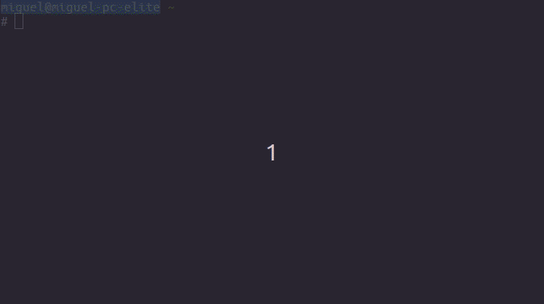

# todos

`todos` is a shell script to help you managing your personal To-Do list for each day.
It's designed to work in Linux environments and tested in Ubuntu.

Since data is stored in text files, you can use common Linux tools, such as `grep`, `cat`, etc to query your data.

## Demo



## Installation

1. Download `todos` from this repository root to a location that's in your path, for example `~/.local/bin`.
2. Make `todos` executable by running `chmod +x ~/.local/bin/todos`.

## How to use it

You can see the list of available commands running `todos --help`:

```
Usage todos [date] [operation] [args...]
date: Any value for date --date=. Default is today
operation:
  add: adds a new entry to the log
  ed/edit: edit the day's log
  done: marks an entry as done
```

The first argument specifies in which date you are operating, next you can select an operation to manage the To-Dos list for that date.

If you don't specify any date, by default today's To-Dos list will be used.

**Examples**:

* Adding a task for tomorrow `todos +1 add "Learn something new"`

* List To-Dos for tomorrow `todos +1`:
```
1. Learn something new
```

* List To-Dos for an specific date `todos 2020-05-02`:
```
1. Play games online with friends [DONE]
```

* List To-Dos for today `todos`:
```
1. Read a chapter of a book
2. Do the groceries
3. Go to the gym
```

* Mark a To-Do as done `todos done 2`

```
1. Read a chapter of a book
2. Do the groceries [DONE]
3. Go to the gym
```

* Edit To-Dos list for tomorrow to add or modify entries `todos +1 ed`. This will show you the To-Dos list using your operating system default text editor.


## How data is stored

A task lists for each day is stored in the `journal` directory inside your home directory.
It's organized by year and month.
For example this is how my To-Do files for the last days of April and the beginning of May looks like:

```
journal/
│
└── 2020/
    ├── 04/
    |   ├── .....
    |   ├── 29.txt
    |   └── 30.txt
    |
    └── 05/
        ├── 01.txt
        └── 02.txt
```

## Sharing data between computers

If you want to keep your To-Dos in sync between various computers, you can make the `journal` directory a link to your DropBox or any cloud storage solution. You can also make your `journal` a git repository and keep track of its history using git.